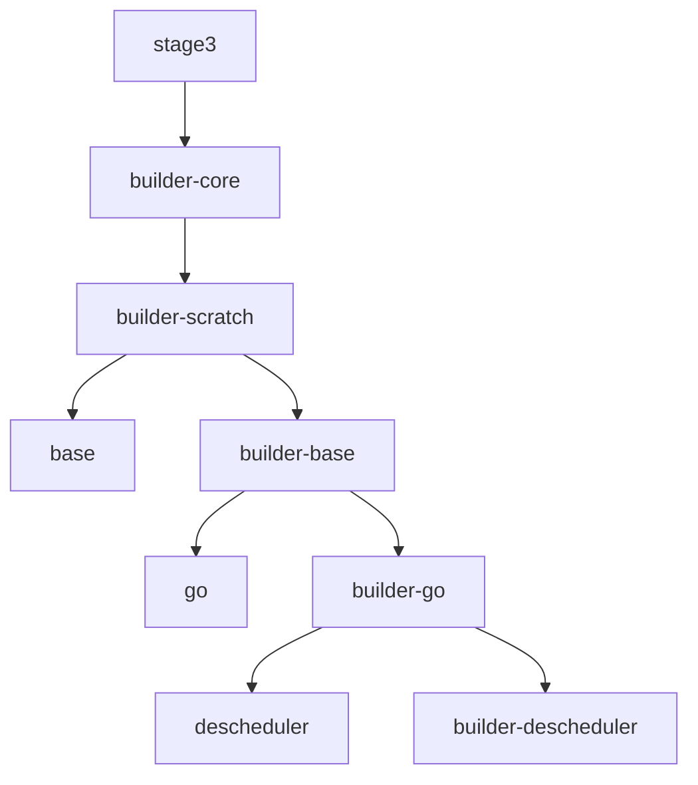

# gentoo-image-builder

This git repository is inspired by [Kubler](https://github.com/edannenberg/kubler) and keeps the approach to create a builder and target image in tandem leveraging [Gentoo](https://www.gentoo.org/)

The resulting images are incredibly small in size (e.g. the smallest busybox using alpine had a size of ~4.6MB, while the Gentoo-based busybox image is 2.6MB)

Initially I used kubler completely but I faced some quirks which made me replace kubler:
- high quality shell scripts but I found it difficult to quickly find issues and to understand the impact of changes in my build chain
- tags:
  - kubler is not flexible for image tags and custom tagging (e.g. I want my nodejs tagged with the version of nodejs, not the portage tag)
  - ":latest" tag is always used while I want to avoid it except for one image
- lack of a central file which includes all my build dependencies

This solution is not (yet) implementing all the features of kubler, especially
- different initial builder
- cross-compiling 

### Preserving across images
portage.provided and /var/db/pkg are preserved inside the builder image. If a new image is build, the builder puts package.provide and /var/db/pkg in place for emerge to consider the related packages as already installed which will later be the case when the image itself is build using the former image as parent image.

### Image tags
Only the base image gets a latest tag, all other tags get dedicated tags with the tags determined in this order:
- explicitly set
- from the software version of the same name
- from the portage version

### Image tests
tests can be specified using test attribute which will be used to execute the container running this command. If it succeeds, image is considered ok.

### build types
On the other hand it goes beyond kubler supporting
- not only kubler build images, but also freely scripted ones and direct pull/push of images from a registry

The process is based on a central image definition structure which includes the type of a build, the description how to build and the image it depends on.
An example can be found in the examples folder.

## Variables
* if the variable images_details_var is set, the role will store details like image section or tag of the input images in a variable named after the content of images_details_var

## How the images are build
From Gentoo a first builder is created called builder-scratch which is used for images that are build "FROM scratch".
Each further image is then build using the builder of the image it is build FROM.

E.g.

