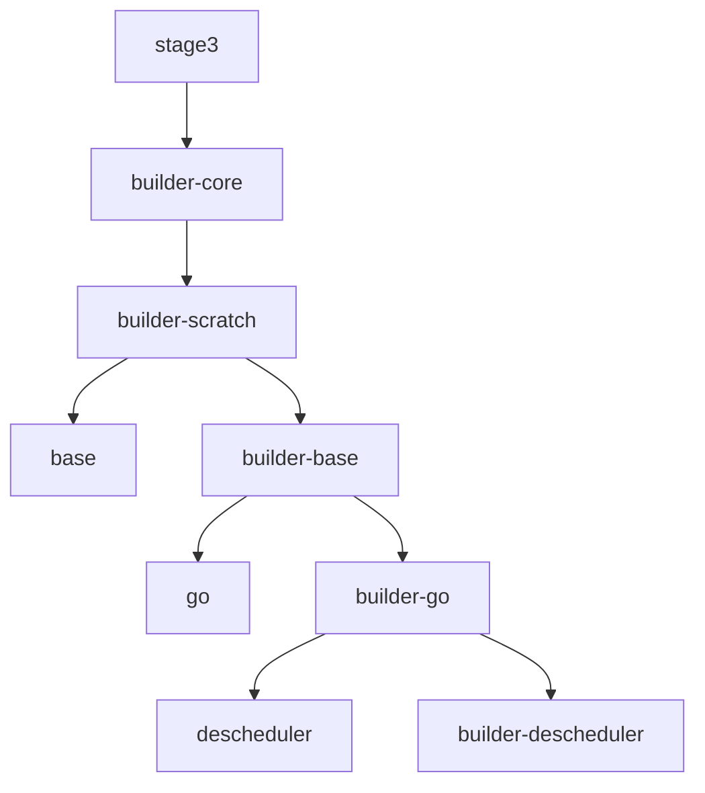

# gentoo-image-builder

This git repository is inspired by [Kubler](https://github.com/edannenberg/kubler) and keeps 
- kubler's build-root.sh script,
- the approach to create a builder and target image in tandem and
- [Gentoo](https://www.gentoo.org/)

The resulting images are incredibly small in size (e.g. the smallest busybox using alpine had a size of ~4.6MB, while the Gentoo-based busybox image is 2.6MB)

Nevertheless I faced some quirks which made me replace kubler:
- high quality shell scripts but I found it difficult to quickly find issues and to understand the impact of changes in my build chain
- tags:
  - kubler is not flexible for image tags and custom tagging (e.g. I want my nodejs tagged with the version of nodejs, not the portage tag)
  - ":latest" tag is always used while I want to avoid it completely
- lack of a central file which includes all my build dependencies

This solution is not (yet) implementing all the features of kubler, especially
- different initial builder
- cross-compiling 

## How the images are build
From Gentoo a first builder is created called builder-scratch which is used for images that are build "FROM scratch".
Each further image is then build using the builder of the image it is build FROM.

E.g.

